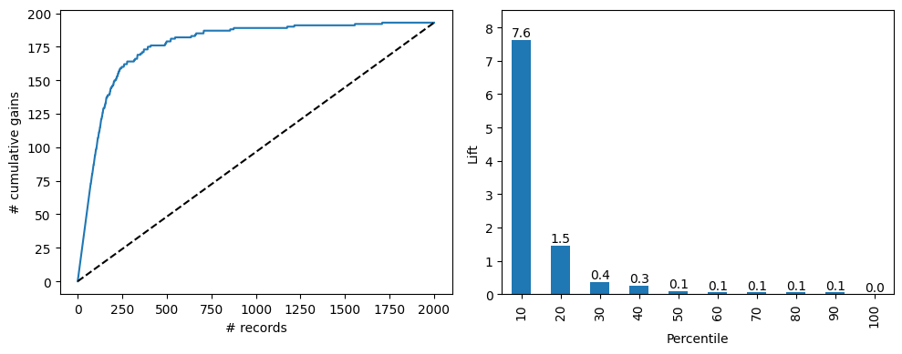
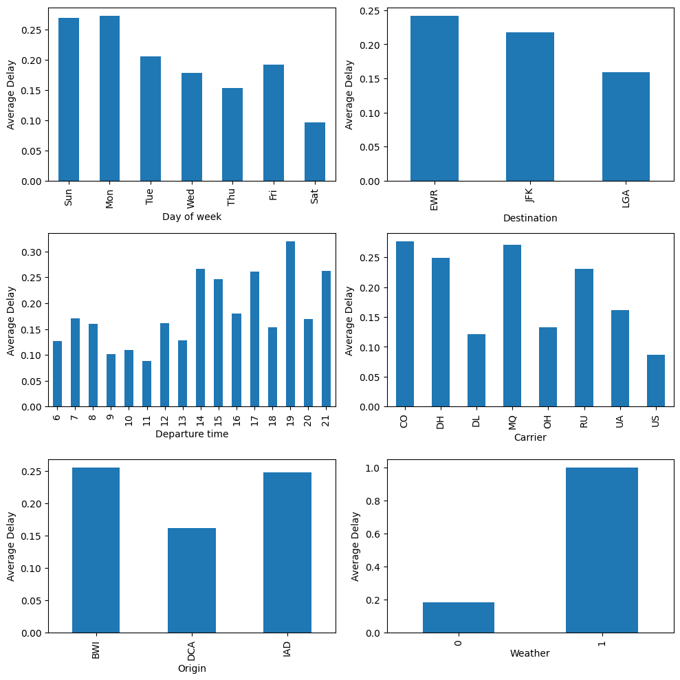
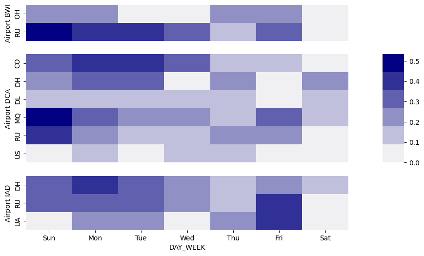
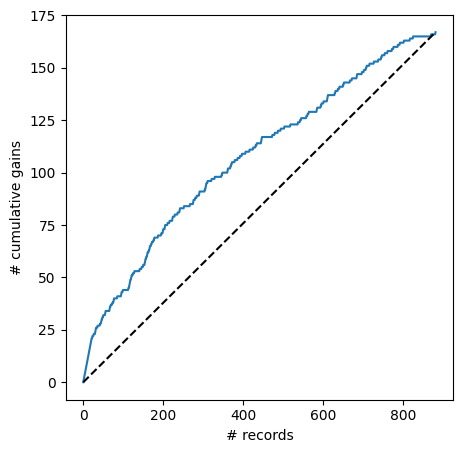
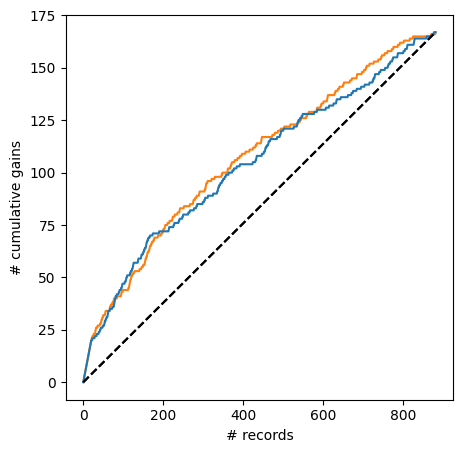

## Chapter 10 Logistic Regression

**Original Code Credit:**: Shmueli, Galit; Bruce, Peter C.; Gedeck, Peter; Patel, Nitin R.. Data Mining for Business Analytics Wiley.

*Modifications* have been made from the original textbook examples due to version changes in library dependencies and/or for clarity.

Download this notebook and data [**here**](https://github.com/dcyoung23/msba511/tree/main/resources/examples).

### Import Libraries


```python
import os
import numpy as np
import pandas as pd
from sklearn.linear_model import LogisticRegression, LogisticRegressionCV
from sklearn.model_selection import train_test_split
import statsmodels.api as sm
from mord import LogisticIT
import matplotlib.pyplot as plt
import seaborn as sns
from dmba import classificationSummary, gainsChart, liftChart
from dmba.metric import AIC_score

import matplotlib

%matplotlib inline

SEED = 1
```

### 10.3 Example: Acceptance of Personal Loan

**Logistic regression model for loan acceptance (training data)**


```python
bank_df = pd.read_csv(os.path.join('data', 'UniversalBank.csv'))
bank_df.drop(columns=['ID', 'ZIP Code'], inplace=True)
bank_df.columns = [c.replace(' ', '_') for c in bank_df.columns]

# Treat education as categorical, convert to dummy variables
bank_df['Education'] = bank_df['Education'].astype('category')
new_categories = {1: 'Undergrad', 2: 'Graduate', 3: 'Advanced/Professional'}
bank_df['Education'] = bank_df['Education'].cat.rename_categories(new_categories)
bank_df2 = pd.get_dummies(bank_df, prefix_sep='_', drop_first=True, dtype=int)

y = bank_df2['Personal_Loan']
X = bank_df2.drop(columns=['Personal_Loan'])

# partition data
train_X, valid_X, train_y, valid_y = train_test_split(X, y, test_size=0.4, random_state=SEED)

# fit a logistic regression (set penalty=l2 and C=1e42 to avoid regularization)
logit_reg = LogisticRegression(penalty="l2", C=1e42, solver='liblinear')
logit_reg.fit(train_X, train_y)

print('intercept ', logit_reg.intercept_[0])
pd.DataFrame({'coeff': logit_reg.coef_[0]}, index=X.columns).transpose()
```

    intercept  -12.560703103343736
    


<div>
<style scoped>
    .dataframe tbody tr th:only-of-type {
        vertical-align: middle;
    }

    .dataframe tbody tr th {
        vertical-align: top;
    }

    .dataframe thead th {
        text-align: right;
    }
</style>
<table border="1" class="dataframe">
  <thead>
    <tr style="text-align: right;">
      <th></th>
      <th>Age</th>
      <th>Experience</th>
      <th>Income</th>
      <th>Family</th>
      <th>CCAvg</th>
      <th>Mortgage</th>
      <th>Securities_Account</th>
      <th>CD_Account</th>
      <th>Online</th>
      <th>CreditCard</th>
      <th>Education_Graduate</th>
      <th>Education_Advanced/Professional</th>
    </tr>
  </thead>
  <tbody>
    <tr>
      <th>coeff</th>
      <td>-0.035686</td>
      <td>0.037234</td>
      <td>0.058921</td>
      <td>0.61268</td>
      <td>0.240926</td>
      <td>0.001015</td>
      <td>-1.029088</td>
      <td>3.662056</td>
      <td>-0.679537</td>
      <td>-0.960725</td>
      <td>4.21121</td>
      <td>4.36177</td>
    </tr>
  </tbody>
</table>
</div>


```python
print('AIC', AIC_score(valid_y, logit_reg.predict(valid_X), df = len(train_X.columns) + 1))
```

    AIC -733.9975169177105
    

### 10.4 Evaluating Classification Performance

**Propensities for four customers in validation data**


```python
logit_reg_pred = logit_reg.predict(valid_X)
logit_reg_proba = logit_reg.predict_proba(valid_X)
logit_result = pd.DataFrame({'actual': valid_y, 
                             'p(0)': [p[0] for p in logit_reg_proba],
                             'p(1)': [p[1] for p in logit_reg_proba],
                             'predicted': logit_reg_pred })
              
# display four different cases
interestingCases = [2764, 932, 2721, 702]
print(logit_result.loc[interestingCases])
```

          actual      p(0)      p(1)  predicted
    2764       0  0.976165  0.023835          0
    932        0  0.331940  0.668060          1
    2721       1  0.031254  0.968746          1
    702        1  0.985943  0.014057          0
    

**Training and Validation Confusion Matrices**


```python
# training confusion matrix
classificationSummary(train_y, logit_reg.predict(train_X))

# validation confusion matrix
classificationSummary(valid_y, logit_reg.predict(valid_X))
```

    Confusion Matrix (Accuracy 0.9600)
    
           Prediction
    Actual    0    1
         0 2683   30
         1   90  197
    Confusion Matrix (Accuracy 0.9600)
    
           Prediction
    Actual    0    1
         0 1791   16
         1   64  129
    

**Cumulative gains chart and decile-wise lift chart for the validation data for Universal Bank loan offer**


```python
df = logit_result.sort_values(by=['p(1)'], ascending=False)
fig, axes = plt.subplots(nrows=1, ncols=2, figsize=(10, 4))

gainsChart(df.actual, ax=axes[0])
liftChart(df.actual, title=False, ax=axes[1])

plt.tight_layout()
plt.show()
```


    

    


### 10.5 Logistic Regression for Multi-class Classification

**Ordinal and nominal (multi-class) regression in Python**


```python
data = pd.read_csv(os.path.join('data', 'accidentsFull.csv'))
outcome = 'MAX_SEV_IR'
predictors = ['ALCHL_I', 'WEATHER_R']

y = data[outcome]
X = data[predictors]
train_X, train_y = X, y

print('Nominal logistic regression')
logit = LogisticRegression(penalty="l2", solver='lbfgs', C=1e24)
logit.fit(X, y)
print('  intercept', logit.intercept_)
print('  coefficients', logit.coef_)
print()
probs = logit.predict_proba(X)
results = pd.DataFrame({
    'actual': y, 'predicted': logit.predict(X),
    'P(0)': [p[0] for p in probs],
    'P(1)': [p[1] for p in probs],
    'P(2)': [p[2] for p in probs],
})
print(results.head())
print()

print('Ordinal logistic regression')
logit = LogisticIT(alpha=0)
logit.fit(X, y)
print('  theta', logit.theta_)
print('  coefficients', logit.coef_)
print()
probs = logit.predict_proba(X)
results = pd.DataFrame({
    'actual': y, 'predicted': logit.predict(X),
    'P(0)': [p[0] for p in probs],
    'P(1)': [p[1] for p in probs],
    'P(2)': [p[2] for p in probs],
})
results.head()
```

    Nominal logistic regression
      intercept [-0.17870851  0.81673248 -0.63802397]
      coefficients [[ 0.52491466  0.40469045]
     [ 0.15763357  0.16071816]
     [-0.68254823 -0.56540861]]
    
       actual  predicted      P(0)      P(1)      P(2)
    0       1          1  0.490569  0.498933  0.010498
    1       0          0  0.554023  0.441483  0.004494
    2       0          0  0.554023  0.441483  0.004494
    3       0          1  0.490569  0.498933  0.010498
    4       0          1  0.393700  0.578117  0.028183
    
    Ordinal logistic regression
      theta [-1.06916285  2.77444326]
      coefficients [-0.40112008 -0.25174207]
    
    


<div>
<style scoped>
    .dataframe tbody tr th:only-of-type {
        vertical-align: middle;
    }

    .dataframe tbody tr th {
        vertical-align: top;
    }

    .dataframe thead th {
        text-align: right;
    }
</style>
<table border="1" class="dataframe">
  <thead>
    <tr style="text-align: right;">
      <th></th>
      <th>actual</th>
      <th>predicted</th>
      <th>P(0)</th>
      <th>P(1)</th>
      <th>P(2)</th>
    </tr>
  </thead>
  <tbody>
    <tr>
      <th>0</th>
      <td>1</td>
      <td>1</td>
      <td>0.496205</td>
      <td>0.482514</td>
      <td>0.021281</td>
    </tr>
    <tr>
      <th>1</th>
      <td>0</td>
      <td>0</td>
      <td>0.558866</td>
      <td>0.424510</td>
      <td>0.016624</td>
    </tr>
    <tr>
      <th>2</th>
      <td>0</td>
      <td>0</td>
      <td>0.558866</td>
      <td>0.424510</td>
      <td>0.016624</td>
    </tr>
    <tr>
      <th>3</th>
      <td>0</td>
      <td>1</td>
      <td>0.496205</td>
      <td>0.482514</td>
      <td>0.021281</td>
    </tr>
    <tr>
      <th>4</th>
      <td>0</td>
      <td>1</td>
      <td>0.397402</td>
      <td>0.571145</td>
      <td>0.031453</td>
    </tr>
  </tbody>
</table>
</div>


### 10.6 Example of Complete Analysis: Predicting Delayed Flights


```python
delays_df = pd.read_csv(os.path.join('data', 'FlightDelays.csv'))
# Create an indicator variable
delays_df['isDelayed'] = [1 if status == 'delayed' else 0 
                          for status in delays_df['Flight Status']]
           
def createGraph(group, xlabel, axis):
    groupAverage = delays_df.groupby([group])['isDelayed'].mean()
    if group == 'DAY_WEEK': # rotate so that display starts on Sunday
        groupAverage = groupAverage.reindex(index=np.roll(groupAverage.index,1))
        groupAverage.index = ['Sun', 'Mon', 'Tue', 'Wed', 'Thu', 'Fri', 'Sat']
    ax = groupAverage.plot.bar(color='C0', ax=axis)
    ax.set_ylabel('Average Delay')
    ax.set_xlabel(xlabel)
    return ax
    
def graphDepartureTime(xlabel, axis):
    temp_df = pd.DataFrame({'CRS_DEP_TIME': delays_df['CRS_DEP_TIME'] // 100, 
                            'isDelayed': delays_df['isDelayed']})
    groupAverage = temp_df.groupby(['CRS_DEP_TIME'])['isDelayed'].mean()
    ax = groupAverage.plot.bar(color='C0', ax=axis)
    ax.set_xlabel(xlabel); ax.set_ylabel('Average Delay')
    
fig, axes = plt.subplots(nrows=3, ncols=2, figsize=(10, 10))

createGraph('DAY_WEEK', 'Day of week', axis=axes[0][0])
createGraph('DEST', 'Destination', axis=axes[0][1])
graphDepartureTime('Departure time', axis=axes[1][0])
createGraph('CARRIER', 'Carrier', axis=axes[1][1])
createGraph('ORIGIN', 'Origin', axis=axes[2][0])
createGraph('Weather', 'Weather', axis=axes[2][1])
plt.tight_layout()
```


    

    


**Proportion of delayed flights by each of the six predictors. Time of day is divided into hourly bins**


```python
agg = delays_df.groupby(['ORIGIN', 'DAY_WEEK', 'CARRIER']).isDelayed.mean()
agg = agg.reset_index()

# Define the layout of the graph
height_ratios = []
for i, origin in enumerate(sorted(delays_df.ORIGIN.unique())):
    height_ratios.append(len(agg[agg.ORIGIN == origin].CARRIER.unique()))
gridspec_kw = {'height_ratios': height_ratios, 'width_ratios': [15, 1]}
fig, axes = plt.subplots(nrows=3, ncols=2, figsize=(10, 6), 
                         gridspec_kw = gridspec_kw)
axes[0, 1].axis('off')
axes[2, 1].axis('off')

maxIsDelay = agg.isDelayed.max()
for i, origin in enumerate(sorted(delays_df.ORIGIN.unique())):
    data = pd.pivot_table(agg[agg.ORIGIN == origin], values='isDelayed', aggfunc='sum', 
                          index=['CARRIER'], columns=['DAY_WEEK'])
    data = data[[7, 1, 2, 3, 4, 5, 6]]  # Shift last columns to first
    ax = sns.heatmap(data, ax=axes[i][0], vmin=0, vmax=maxIsDelay, 
                     cbar_ax=axes[1][1], cmap=sns.light_palette("navy"))
    ax.set_xticklabels(['Sun', 'Mon', 'Tue', 'Wed', 'Thu', 'Fri', 'Sat'])
    if i != 2: 
        ax.get_xaxis().set_visible(False)
    ax.set_ylabel('Airport ' + origin)
plt.show()
```


    

    


**Estimated Logistic regression model for delayed flights (based on the training set)**


```python
# convert to categorical
delays_df.DAY_WEEK = delays_df.DAY_WEEK.astype('category')

# create hourly bins departure time 
delays_df.CRS_DEP_TIME = [round(t / 100) for t in delays_df.CRS_DEP_TIME]
delays_df.CRS_DEP_TIME = delays_df.CRS_DEP_TIME.astype('category')

predictors = ['DAY_WEEK', 'CRS_DEP_TIME', 'ORIGIN', 'DEST', 'CARRIER', 'Weather']
outcome = 'isDelayed'

X = pd.get_dummies(delays_df[predictors], drop_first=True)
y = delays_df[outcome]
classes = ['ontime', 'delayed']

# split into training and validation
train_X, valid_X, train_y, valid_y = train_test_split(X, y, test_size=0.4, random_state=SEED)

logit_full = LogisticRegression(penalty="l2", C=1e42, solver='liblinear')
logit_full.fit(train_X, train_y)

print('intercept ', logit_full.intercept_[0])
pd.DataFrame({'coeff': logit_full.coef_[0]}, index=X.columns).transpose()
```

    intercept  -1.2191068769073172
    


<div>
<style scoped>
    .dataframe tbody tr th:only-of-type {
        vertical-align: middle;
    }

    .dataframe tbody tr th {
        vertical-align: top;
    }

    .dataframe thead th {
        text-align: right;
    }
</style>
<table border="1" class="dataframe">
  <thead>
    <tr style="text-align: right;">
      <th></th>
      <th>Weather</th>
      <th>DAY_WEEK_2</th>
      <th>DAY_WEEK_3</th>
      <th>DAY_WEEK_4</th>
      <th>DAY_WEEK_5</th>
      <th>DAY_WEEK_6</th>
      <th>DAY_WEEK_7</th>
      <th>CRS_DEP_TIME_7</th>
      <th>CRS_DEP_TIME_8</th>
      <th>CRS_DEP_TIME_9</th>
      <th>...</th>
      <th>ORIGIN_IAD</th>
      <th>DEST_JFK</th>
      <th>DEST_LGA</th>
      <th>CARRIER_DH</th>
      <th>CARRIER_DL</th>
      <th>CARRIER_MQ</th>
      <th>CARRIER_OH</th>
      <th>CARRIER_RU</th>
      <th>CARRIER_UA</th>
      <th>CARRIER_US</th>
    </tr>
  </thead>
  <tbody>
    <tr>
      <th>coeff</th>
      <td>9.325014</td>
      <td>-0.597928</td>
      <td>-0.704795</td>
      <td>-0.798678</td>
      <td>-0.295774</td>
      <td>-1.129236</td>
      <td>-0.135377</td>
      <td>0.631496</td>
      <td>0.382262</td>
      <td>-0.365022</td>
      <td>...</td>
      <td>-0.134055</td>
      <td>-0.523642</td>
      <td>-0.545662</td>
      <td>0.352302</td>
      <td>-0.684517</td>
      <td>0.743163</td>
      <td>-0.710518</td>
      <td>-0.194203</td>
      <td>0.315418</td>
      <td>-0.97143</td>
    </tr>
  </tbody>
</table>
<p>1 rows × 33 columns</p>
</div>


```python
print('AIC', AIC_score(valid_y, logit_full.predict(valid_X), df = len(train_X.columns) + 1))
```

    AIC 1004.5346225948085
    

**Evaluating performance of all-predictor model on validation**


```python
logit_reg_pred = logit_full.predict_proba(valid_X)
full_result = pd.DataFrame({'actual': valid_y, 
                            'p(0)': [p[0] for p in logit_reg_pred],
                            'p(1)': [p[1] for p in logit_reg_pred],
                            'predicted': logit_full.predict(valid_X)})
full_result = full_result.sort_values(by=['p(1)'], ascending=False)

# confusion matrix
classificationSummary(full_result.actual, full_result.predicted, class_names=classes)

gainsChart(full_result.actual, figsize=[5, 5])
plt.show()
```

    Confusion Matrix (Accuracy 0.8309)
    
            Prediction
     Actual  ontime delayed
     ontime     705       9
    delayed     140      27
    


    

    


**Logistic regression model with fewer predictors**


```python
delays_df['CRS_DEP_TIME'] = [round(t / 100) for t in delays_df['CRS_DEP_TIME']]
delays_red_df = pd.DataFrame({
    'Sun_Mon' : [1 if d in (1, 7) else 0 for d in delays_df.DAY_WEEK],
    'Weather' : delays_df.Weather,
    'CARRIER_CO_MQ_DH_RU' : [1 if d in ("CO", "MQ", "DH", "RU") else 0 
                             for d in delays_df.CARRIER],
    'MORNING' : [1 if d in (6, 7, 8, 9) else 0 for d in delays_df.CRS_DEP_TIME],
    'NOON' : [1 if d in (10, 11, 12, 13) else 0 for d in delays_df.CRS_DEP_TIME],
    'AFTER2P' : [1 if d in (14, 15, 16, 17, 18) else 0 for d in delays_df.CRS_DEP_TIME],
    'EVENING' : [1 if d in (19, 20) else 0 for d in delays_df.CRS_DEP_TIME],
    'isDelayed' : [1 if status == 'delayed' else 0 for status in delays_df['Flight Status']],
})

X = delays_red_df.drop(columns=['isDelayed'])
y = delays_red_df['isDelayed']
classes = ['ontime', 'delayed']

# split into training and validation
train_X, valid_X, train_y, valid_y = train_test_split(X, y, test_size=0.4, 
                                                      random_state=SEED)
                        
logit_red = LogisticRegressionCV(penalty="l1", solver='liblinear', cv=5)
logit_red.fit(train_X, train_y)

print('intercept ', logit_red.intercept_[0])
pd.DataFrame({'coeff': logit_red.coef_[0]}, index=X.columns).transpose()

```

    intercept  -2.509726593729543
    


<div>
<style scoped>
    .dataframe tbody tr th:only-of-type {
        vertical-align: middle;
    }

    .dataframe tbody tr th {
        vertical-align: top;
    }

    .dataframe thead th {
        text-align: right;
    }
</style>
<table border="1" class="dataframe">
  <thead>
    <tr style="text-align: right;">
      <th></th>
      <th>Sun_Mon</th>
      <th>Weather</th>
      <th>CARRIER_CO_MQ_DH_RU</th>
      <th>MORNING</th>
      <th>NOON</th>
      <th>AFTER2P</th>
      <th>EVENING</th>
    </tr>
  </thead>
  <tbody>
    <tr>
      <th>coeff</th>
      <td>0.625337</td>
      <td>4.920328</td>
      <td>1.281507</td>
      <td>0.0</td>
      <td>0.0</td>
      <td>0.0</td>
      <td>0.0</td>
    </tr>
  </tbody>
</table>
</div>


```python

```


```python
print('AIC', AIC_score(valid_y, logit_red.predict(valid_X), df=len(train_X.columns) + 1))

# confusion matrix
classificationSummary(valid_y, logit_red.predict(valid_X), class_names=classes)
```

    AIC 940.6290360089256
    Confusion Matrix (Accuracy 0.8331)
    
            Prediction
     Actual  ontime delayed
     ontime     714       0
    delayed     147      20
    


```python
logit_reg_proba = logit_red.predict_proba(valid_X)
red_result = pd.DataFrame({'actual': valid_y, 
                            'p(0)': [p[0] for p in logit_reg_proba],
                            'p(1)': [p[1] for p in logit_reg_proba],
                            'predicted': logit_red.predict(valid_X),
                          })
red_result = red_result.sort_values(by=['p(1)'], ascending=False)

ax = gainsChart(full_result.actual, color='C1', figsize=[5, 5])
gainsChart(red_result.actual, color='C0', ax=ax)
plt.show()
```


    

    


**Logistic regression model for loan acceptance using Statmodels**


```python
# add constant column
y = bank_df2['Personal_Loan']
X = bank_df2.drop(columns=['Personal_Loan'])
X = sm.add_constant(X, prepend=True)

# partition data
train_X, valid_X, train_y, valid_y = train_test_split(X, y, test_size=0.4, random_state=SEED)

# use GLM (general linear model) with the binomial family to fit a logistic regression
logit_reg = sm.GLM(train_y, train_X, family=sm.families.Binomial())
logit_result = logit_reg.fit()
logit_result.summary()
```


<table class="simpletable">
<caption>Generalized Linear Model Regression Results</caption>
<tr>
  <th>Dep. Variable:</th>     <td>Personal_Loan</td>  <th>  No. Observations:  </th>  <td>  3000</td> 
</tr>
<tr>
  <th>Model:</th>                  <td>GLM</td>       <th>  Df Residuals:      </th>  <td>  2987</td> 
</tr>
<tr>
  <th>Model Family:</th>        <td>Binomial</td>     <th>  Df Model:          </th>  <td>    12</td> 
</tr>
<tr>
  <th>Link Function:</th>         <td>Logit</td>      <th>  Scale:             </th> <td>  1.0000</td>
</tr>
<tr>
  <th>Method:</th>                <td>IRLS</td>       <th>  Log-Likelihood:    </th> <td> -340.15</td>
</tr>
<tr>
  <th>Date:</th>            <td>Mon, 07 Apr 2025</td> <th>  Deviance:          </th> <td>  680.30</td>
</tr>
<tr>
  <th>Time:</th>                <td>07:32:46</td>     <th>  Pearson chi2:      </th> <td>8.10e+03</td>
</tr>
<tr>
  <th>No. Iterations:</th>          <td>8</td>        <th>  Pseudo R-squ. (CS):</th>  <td>0.3325</td> 
</tr>
<tr>
  <th>Covariance Type:</th>     <td>nonrobust</td>    <th>                     </th>     <td> </td>   
</tr>
</table>
<table class="simpletable">
<tr>
                 <td></td>                    <th>coef</th>     <th>std err</th>      <th>z</th>      <th>P>|z|</th>  <th>[0.025</th>    <th>0.975]</th>  
</tr>
<tr>
  <th>const</th>                           <td>  -12.5634</td> <td>    2.336</td> <td>   -5.377</td> <td> 0.000</td> <td>  -17.143</td> <td>   -7.984</td>
</tr>
<tr>
  <th>Age</th>                             <td>   -0.0354</td> <td>    0.086</td> <td>   -0.412</td> <td> 0.680</td> <td>   -0.204</td> <td>    0.133</td>
</tr>
<tr>
  <th>Experience</th>                      <td>    0.0369</td> <td>    0.086</td> <td>    0.431</td> <td> 0.666</td> <td>   -0.131</td> <td>    0.205</td>
</tr>
<tr>
  <th>Income</th>                          <td>    0.0589</td> <td>    0.004</td> <td>   15.044</td> <td> 0.000</td> <td>    0.051</td> <td>    0.067</td>
</tr>
<tr>
  <th>Family</th>                          <td>    0.6128</td> <td>    0.103</td> <td>    5.931</td> <td> 0.000</td> <td>    0.410</td> <td>    0.815</td>
</tr>
<tr>
  <th>CCAvg</th>                           <td>    0.2408</td> <td>    0.060</td> <td>    4.032</td> <td> 0.000</td> <td>    0.124</td> <td>    0.358</td>
</tr>
<tr>
  <th>Mortgage</th>                        <td>    0.0010</td> <td>    0.001</td> <td>    1.301</td> <td> 0.193</td> <td>   -0.001</td> <td>    0.003</td>
</tr>
<tr>
  <th>Securities_Account</th>              <td>   -1.0305</td> <td>    0.422</td> <td>   -2.443</td> <td> 0.015</td> <td>   -1.857</td> <td>   -0.204</td>
</tr>
<tr>
  <th>CD_Account</th>                      <td>    3.6628</td> <td>    0.460</td> <td>    7.961</td> <td> 0.000</td> <td>    2.761</td> <td>    4.565</td>
</tr>
<tr>
  <th>Online</th>                          <td>   -0.6794</td> <td>    0.216</td> <td>   -3.140</td> <td> 0.002</td> <td>   -1.103</td> <td>   -0.255</td>
</tr>
<tr>
  <th>CreditCard</th>                      <td>   -0.9609</td> <td>    0.274</td> <td>   -3.507</td> <td> 0.000</td> <td>   -1.498</td> <td>   -0.424</td>
</tr>
<tr>
  <th>Education_Graduate</th>              <td>    4.2075</td> <td>    0.364</td> <td>   11.573</td> <td> 0.000</td> <td>    3.495</td> <td>    4.920</td>
</tr>
<tr>
  <th>Education_Advanced/Professional</th> <td>    4.3580</td> <td>    0.365</td> <td>   11.937</td> <td> 0.000</td> <td>    3.642</td> <td>    5.074</td>
</tr>
</table>


```python

```
