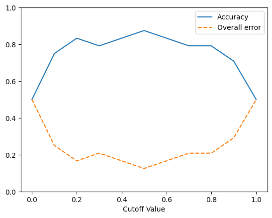
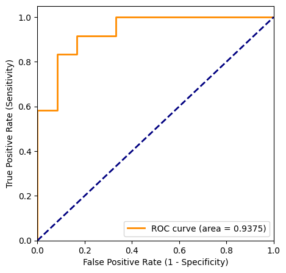
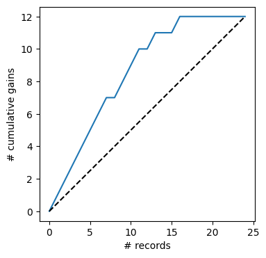
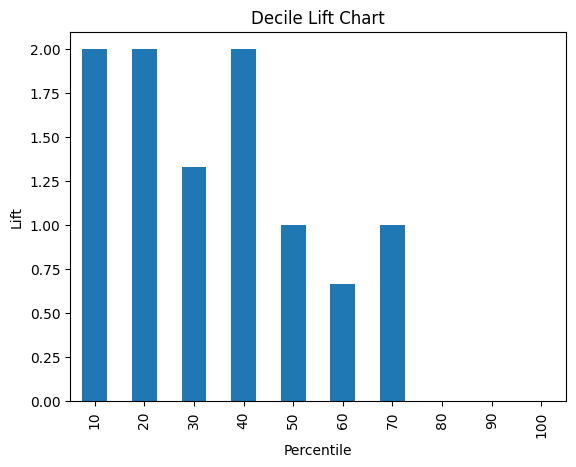

## Chapter 5 Evaluating Predictive Performance

**Original Code Credit:**: Shmueli, Galit; Bruce, Peter C.; Gedeck, Peter; Patel, Nitin R.. Data Mining for Business Analytics Wiley.

*Modifications* have been made from the original textbook examples due to version changes in library dependencies and/or for clarity.

Download this notebook and data [**here**](https://github.com/dcyoung23/msba511/tree/main/resources/examples).

### Import Libraries


```python
import os
import math
import pandas as pd
from sklearn.model_selection import train_test_split
from sklearn.metrics import accuracy_score, roc_curve, auc
import matplotlib.pylab as plt
from dmba import regressionSummary, classificationSummary
from dmba import liftChart, gainsChart
import matplotlib

%matplotlib inline
```

    no display found. Using non-interactive Agg backend
    

### 5.3 Judging Classifier Performance


```python
owner_df = pd.read_csv(os.path.join('data', 'ownerExample.csv'))
owner_df
```


<div>
<style scoped>
    .dataframe tbody tr th:only-of-type {
        vertical-align: middle;
    }

    .dataframe tbody tr th {
        vertical-align: top;
    }

    .dataframe thead th {
        text-align: right;
    }
</style>
<table border="1" class="dataframe">
  <thead>
    <tr style="text-align: right;">
      <th></th>
      <th>Class</th>
      <th>Probability</th>
    </tr>
  </thead>
  <tbody>
    <tr>
      <th>0</th>
      <td>owner</td>
      <td>0.9959</td>
    </tr>
    <tr>
      <th>1</th>
      <td>owner</td>
      <td>0.9875</td>
    </tr>
    <tr>
      <th>2</th>
      <td>owner</td>
      <td>0.9844</td>
    </tr>
    <tr>
      <th>3</th>
      <td>owner</td>
      <td>0.9804</td>
    </tr>
    <tr>
      <th>4</th>
      <td>owner</td>
      <td>0.9481</td>
    </tr>
    <tr>
      <th>5</th>
      <td>owner</td>
      <td>0.8892</td>
    </tr>
    <tr>
      <th>6</th>
      <td>owner</td>
      <td>0.8476</td>
    </tr>
    <tr>
      <th>7</th>
      <td>nonowner</td>
      <td>0.7628</td>
    </tr>
    <tr>
      <th>8</th>
      <td>owner</td>
      <td>0.7069</td>
    </tr>
    <tr>
      <th>9</th>
      <td>owner</td>
      <td>0.6807</td>
    </tr>
    <tr>
      <th>10</th>
      <td>owner</td>
      <td>0.6563</td>
    </tr>
    <tr>
      <th>11</th>
      <td>nonowner</td>
      <td>0.6224</td>
    </tr>
    <tr>
      <th>12</th>
      <td>owner</td>
      <td>0.5055</td>
    </tr>
    <tr>
      <th>13</th>
      <td>nonowner</td>
      <td>0.4713</td>
    </tr>
    <tr>
      <th>14</th>
      <td>nonowner</td>
      <td>0.3371</td>
    </tr>
    <tr>
      <th>15</th>
      <td>owner</td>
      <td>0.2179</td>
    </tr>
    <tr>
      <th>16</th>
      <td>nonowner</td>
      <td>0.1992</td>
    </tr>
    <tr>
      <th>17</th>
      <td>nonowner</td>
      <td>0.1494</td>
    </tr>
    <tr>
      <th>18</th>
      <td>nonowner</td>
      <td>0.0479</td>
    </tr>
    <tr>
      <th>19</th>
      <td>nonowner</td>
      <td>0.0383</td>
    </tr>
    <tr>
      <th>20</th>
      <td>nonowner</td>
      <td>0.0248</td>
    </tr>
    <tr>
      <th>21</th>
      <td>nonowner</td>
      <td>0.0218</td>
    </tr>
    <tr>
      <th>22</th>
      <td>nonowner</td>
      <td>0.0161</td>
    </tr>
    <tr>
      <th>23</th>
      <td>nonowner</td>
      <td>0.0031</td>
    </tr>
  </tbody>
</table>
</div>


```python
## cutoff = 0.5
predicted = ['owner' if p > 0.5 else 'nonowner' for p in owner_df.Probability]
classificationSummary(owner_df.Class, predicted, class_names=['nonowner', 'owner'])
```

    Confusion Matrix (Accuracy 0.8750)
    
             Prediction
      Actual nonowner    owner
    nonowner       10        2
       owner        1       11
    


```python
## cutoff = 0.25               
predicted = ['owner' if p > 0.25 else 'nonowner' for p in owner_df.Probability]
classificationSummary(owner_df.Class, predicted, class_names=['nonowner', 'owner'])
```

    Confusion Matrix (Accuracy 0.7917)
    
             Prediction
      Actual nonowner    owner
    nonowner        8        4
       owner        1       11
    


```python
## cutoff = 0.75
predicted = ['owner' if p > 0.75 else 'nonowner' for p in owner_df.Probability]
classificationSummary(owner_df.Class, predicted, class_names=['nonowner', 'owner'])

```

    Confusion Matrix (Accuracy 0.7500)
    
             Prediction
      Actual nonowner    owner
    nonowner       11        1
       owner        5        7
    


```python
df = pd.read_csv(os.path.join('data', 'liftExample.csv'))

cutoffs = [i * 0.1 for i in range(0, 11)]
accT = []
for cutoff in cutoffs:
    predicted = [1 if p > cutoff else 0 for p in df.prob]
    accT.append(accuracy_score(df.actual, predicted))

line_accuracy = plt.plot(cutoffs, accT, '-', label='Accuracy')[0]
line_error = plt.plot(cutoffs, [1 - acc for acc in accT], '--', label='Overall error')[0]
plt.ylim([0,1])
plt.xlabel('Cutoff Value')
plt.legend(handles=[line_accuracy, line_error])
plt.show()
```


    

    


```python

# compute ROC curve and AUC
fpr, tpr, _ = roc_curve(df.actual, df.prob)
roc_auc = auc(fpr, tpr)

plt.figure(figsize=[5, 5])
plt.plot(fpr, tpr, color='darkorange',
         lw=2, label='ROC curve (area = %0.4f)' % roc_auc)
plt.plot([0, 1], [0, 1], color='navy', lw=2, linestyle='--')
plt.xlim([0.0, 1.0])
plt.ylim([0.0, 1.05])
plt.xlabel('False Positive Rate (1 - Specificity)')
plt.ylabel('True Positive Rate (Sensitivity)')
plt.legend(loc="lower right")
plt.show()
```


    

    


### 5.4 Judging Ranking Performance


```python
df = df.sort_values(by=['prob'], ascending=False)
gainsChart(df.actual, figsize=(4, 4))
plt.show()
```


    

    


```python
# use liftChart method from utilities
liftChart(df.actual, labelBars=False)
plt.show()
```


    

    


```python

```
