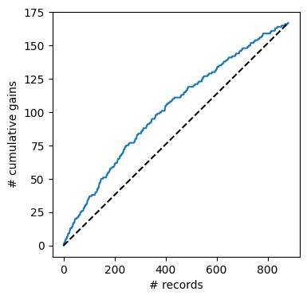

## Chapter 8 The Naive Bayes Classifier

**Original Code Credit:**: Shmueli, Galit; Bruce, Peter C.; Gedeck, Peter; Patel, Nitin R.. Data Mining for Business Analytics Wiley.

*Modifications* have been made from the original textbook examples due to version changes in library dependencies and/or for clarity.

Download this notebook and data [**here**](https://github.com/dcyoung23/msba511/tree/main/resources/examples).

### Import Libraries


```python
import os
import pandas as pd
from sklearn.model_selection import train_test_split
from sklearn.naive_bayes import MultinomialNB
import matplotlib.pylab as plt
from dmba import classificationSummary, gainsChart

import matplotlib

%matplotlib inline
```

### 8.2 Applying the Full (Exact) Bayesian Classifier

#### Example 3: Predicting Delayed Flights


```python
delays_df = pd.read_csv(os.path.join('data', 'FlightDelays.csv'))

# convert to categorical
delays_df.DAY_WEEK = delays_df.DAY_WEEK.astype('category')
delays_df['Flight Status'] = delays_df['Flight Status'].astype('category')

# create hourly bins departure time 
delays_df.CRS_DEP_TIME = [round(t / 100) for t in delays_df.CRS_DEP_TIME]
delays_df.CRS_DEP_TIME = delays_df.CRS_DEP_TIME.astype('category')

predictors = ['DAY_WEEK', 'CRS_DEP_TIME', 'ORIGIN', 'DEST', 'CARRIER']
outcome = 'Flight Status'

X = pd.get_dummies(delays_df[predictors])
y = delays_df['Flight Status'].astype('category')
classes = list(y.cat.categories)

# split into training and validation
X_train, X_valid, y_train, y_valid = train_test_split(X, y, test_size=0.40, 
                                                      random_state=1)

# run naive Bayes
delays_nb = MultinomialNB(alpha=0.01)
delays_nb.fit(X_train, y_train)

# predict probabilities
predProb_train = delays_nb.predict_proba(X_train)
predProb_valid = delays_nb.predict_proba(X_valid)

# predict class membership
y_train_pred = delays_nb.predict(X_train)

print('Train Predictions Shape: ', y_train_pred.shape)

# predict class membership
y_valid_pred = delays_nb.predict(X_valid)

print('Validation Predictions Shape: ', y_valid_pred.shape)
```

    Train Predictions Shape:  (1320,)
    Validation Predictions Shape:  (881,)
    


```python
# split the original data frame into a train and test using the same random_state
train_df, valid_df = train_test_split(delays_df, test_size=0.4, random_state=1)

pd.set_option('display.precision', 4)
# probability of flight status
print(train_df['Flight Status'].value_counts() / len(train_df))
print()

for predictor in predictors:
    # construct the frequency table
    df = train_df[['Flight Status', predictor]]
    freqTable = df.pivot_table(index='Flight Status', columns=predictor, aggfunc=len, observed=False)

    # divide each value by the sum of the row to get conditional probabilities
    propTable = freqTable.apply(lambda x: x / sum(x), axis=1)
    print(propTable)
    print()
pd.reset_option('precision')
```

    Flight Status
    ontime     0.8023
    delayed    0.1977
    Name: count, dtype: float64
    
    DAY_WEEK            1       2       3       4       5      6       7
    Flight Status                                                       
    delayed        0.1916  0.1494  0.1149  0.1264  0.1877  0.069  0.1609
    ontime         0.1246  0.1416  0.1445  0.1794  0.1690  0.136  0.1048
    
    CRS_DEP_TIME        6       7       8       9      10      11      12      13  \
    Flight Status                                                                   
    delayed        0.0345  0.0536  0.0651  0.0192  0.0307  0.0115  0.0498  0.0460   
    ontime         0.0623  0.0633  0.0850  0.0567  0.0519  0.0340  0.0661  0.0746   
    
    CRS_DEP_TIME       14      15      16      17      18      19      20      21  
    Flight Status                                                                  
    delayed        0.0383  0.2031  0.0728  0.1533  0.0192  0.0996  0.0153  0.0881  
    ontime         0.0576  0.1171  0.0774  0.1001  0.0349  0.0397  0.0264  0.0529  
    
    ORIGIN            BWI     DCA     IAD
    Flight Status                        
    delayed        0.0805  0.5211  0.3985
    ontime         0.0604  0.6478  0.2918
    
    DEST              EWR     JFK     LGA
    Flight Status                        
    delayed        0.3793  0.1992  0.4215
    ontime         0.2663  0.1558  0.5779
    
    CARRIER            CO      DH      DL      MQ      OH      RU      UA      US
    Flight Status                                                                
    delayed        0.0575  0.3142  0.0958  0.2222  0.0077  0.2184  0.0153  0.0690
    ontime         0.0349  0.2295  0.2040  0.1171  0.0104  0.1690  0.0170  0.2181
    
    


```python
# classify a specific flight by searching in the dataset 
# for a flight with the same predictor values
df = pd.concat([pd.DataFrame({'actual': y_valid, 'predicted': y_valid_pred}),
                pd.DataFrame(predProb_valid, index=y_valid.index)], axis=1)
mask = ((X_valid.CARRIER_DL == 1) & (X_valid.DAY_WEEK_7 == 1) &
        (X_valid.CRS_DEP_TIME_10 == 1) &  (X_valid.DEST_LGA == 1) &
        (X_valid.ORIGIN_DCA == 1))

df[mask]
```


<div>
<style scoped>
    .dataframe tbody tr th:only-of-type {
        vertical-align: middle;
    }

    .dataframe tbody tr th {
        vertical-align: top;
    }

    .dataframe thead th {
        text-align: right;
    }
</style>
<table border="1" class="dataframe">
  <thead>
    <tr style="text-align: right;">
      <th></th>
      <th>actual</th>
      <th>predicted</th>
      <th>0</th>
      <th>1</th>
    </tr>
  </thead>
  <tbody>
    <tr>
      <th>1225</th>
      <td>ontime</td>
      <td>ontime</td>
      <td>0.057989</td>
      <td>0.942011</td>
    </tr>
  </tbody>
</table>
</div>


```python
# training
classificationSummary(y_train, y_train_pred, class_names=classes) 

# validation
classificationSummary(y_valid, y_valid_pred, class_names=classes)
```

    Confusion Matrix (Accuracy 0.7955)
    
            Prediction
     Actual delayed  ontime
    delayed      52     209
     ontime      61     998
    Confusion Matrix (Accuracy 0.7821)
    
            Prediction
     Actual delayed  ontime
    delayed      26     141
     ontime      51     663
    


```python
df = pd.DataFrame({'actual': 1 - y_valid.cat.codes, 'prob': predProb_valid[:, 0]})
df = df.sort_values(by=['prob'], ascending=False).reset_index(drop=True)

fig, ax = plt.subplots()
fig.set_size_inches(4, 4)
gainsChart(df.actual, ax=ax)
plt.show()
```


    

    


```python

```
